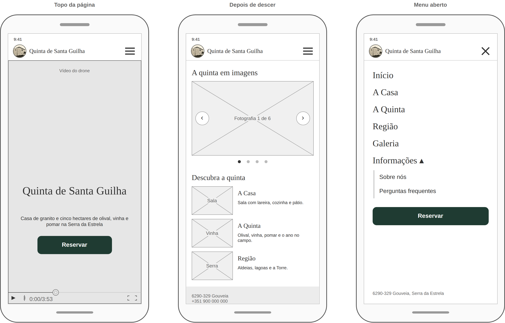
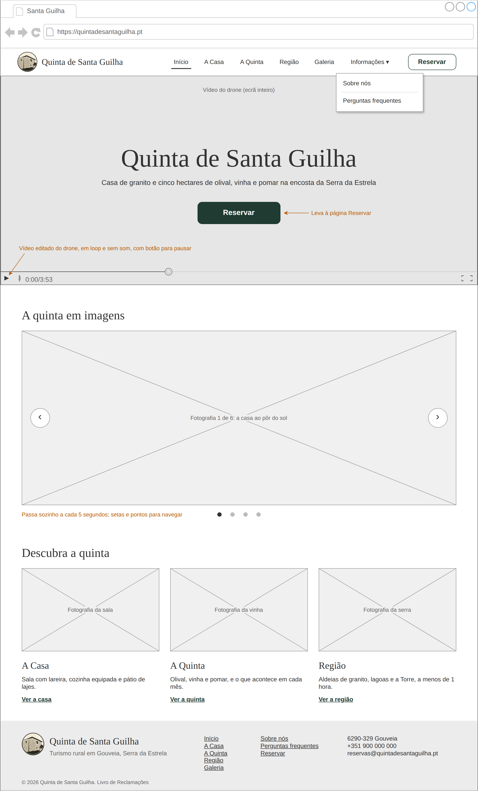
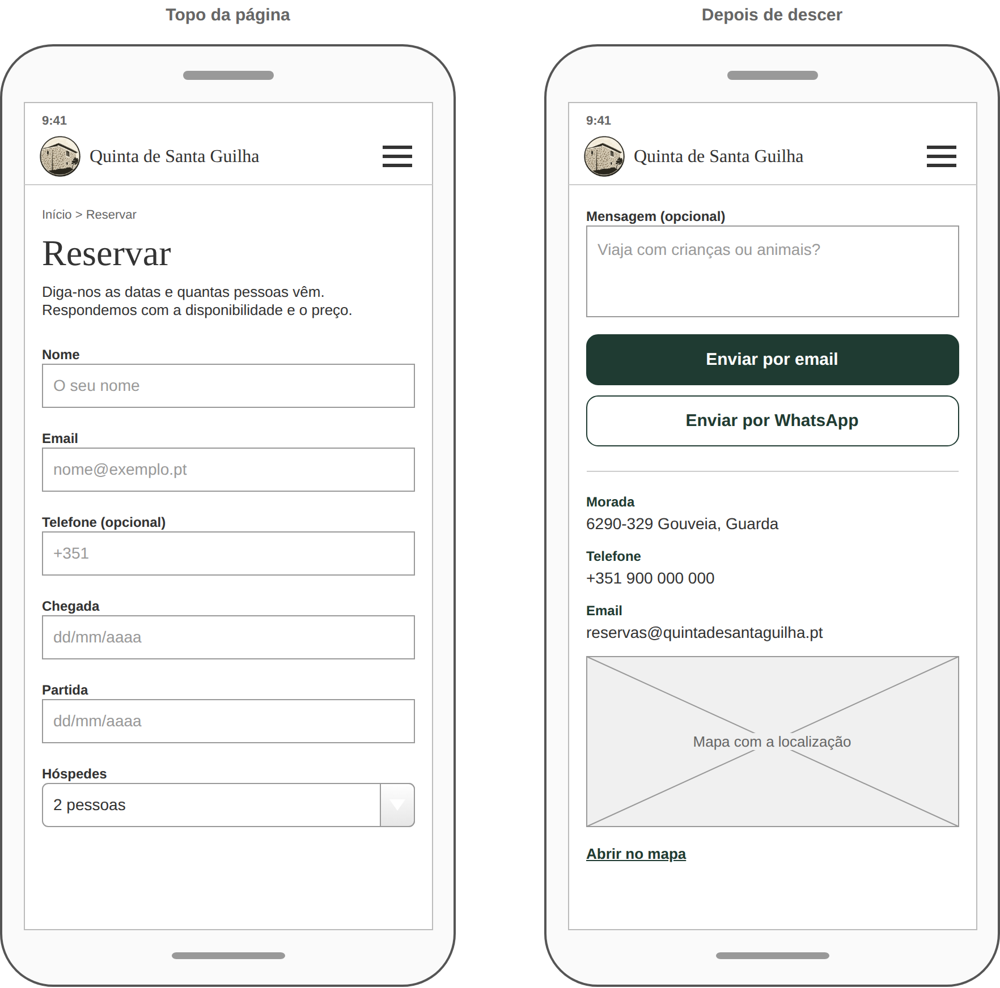
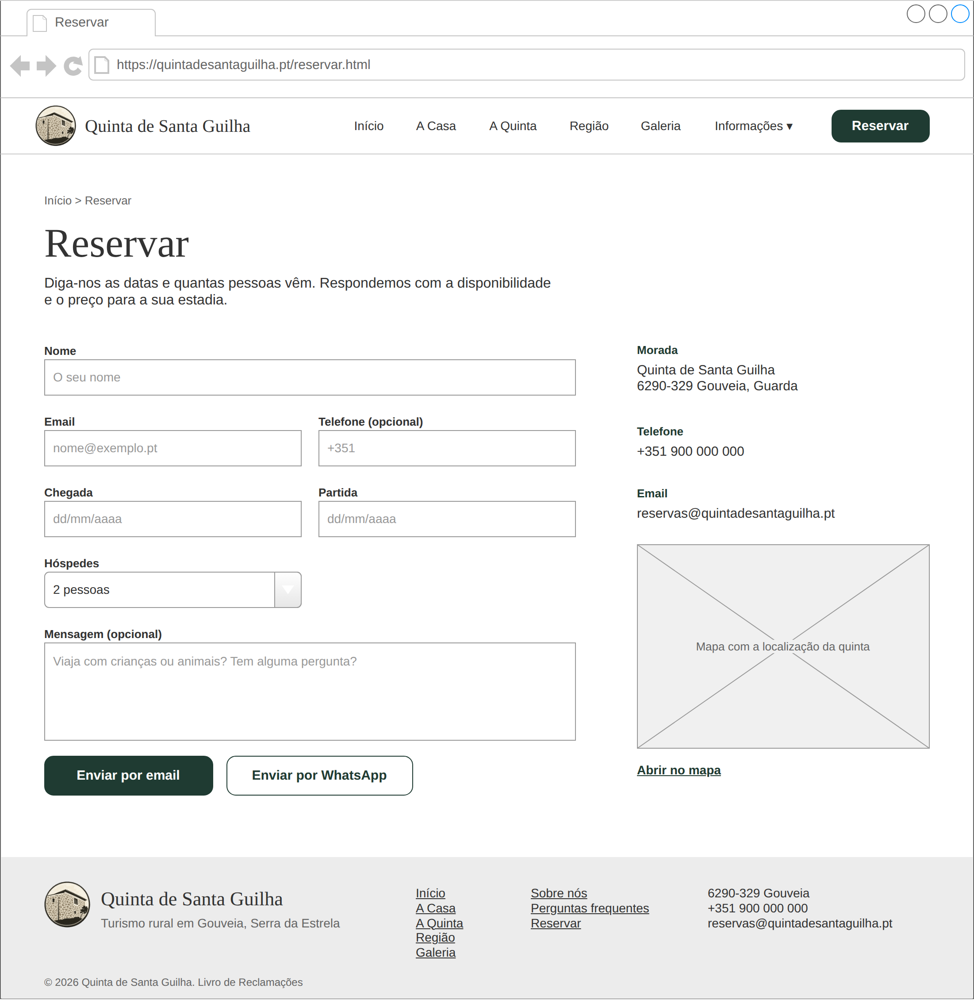

# Quinta de Santa Guilha

Website de turismo rural da Quinta de Santa Guilha, em Gouveia (Serra da Estrela).

Projeto da unidade curricular **Desenvolvimento para a Web**, da Licenciatura em Ciência de Dados para a Gestão (Coimbra Business School | ISCAC), ano letivo 2026/2027.

## Grupo

- André Filipe Souza Kingwell a2024134754
- João Filipe Loureiro da Silva a2024134076

## O projeto

A Quinta de Santa Guilha é uma casa tradicional de granito com cinco hectares de olival, vinha, pomar e nogueiral, na encosta da Serra da Estrela.

O website serve para dar a conhecer a quinta: mostrar a casa e a região num site que funcione bem no telemóvel e permitir que os visitantes peçam uma reserva diretamente, sem depender de plataformas como o Booking ou o Airbnb.

## Estrutura do website

O website tem oito páginas. O menu aparece em todas: o item Informações abre um submenu com Sobre nós e Perguntas frequentes, e o botão Reservar fica sempre em destaque. No telemóvel, o menu passa a um botão.

```
Menu: Início | A Casa | A Quinta | Região | Galeria | Informações | Reservar

Início ....................... vídeo de drone ou imagem, slideshow e destaques
├── A Casa ................... espaços, comodidades e fotografias da casa
├── A Quinta ................. olival, vinha, pomar e "O ano na quinta"
├── Região ................... lugares a visitar e tempos de viagem
├── Galeria .................. grelha de fotografias com visualizador
├── Informações
│   ├── Sobre nós ............ história da casa e da família Loureiro
│   └── Perguntas frequentes . entrada e saída, animais, acessos, pagamento
└── Reservar ................. pedido de reserva, contactos e mapa
```

## Funcionalidades

### Básicas

- Menu de navegação em todas as páginas, com o submenu Informações (Sobre nós e Perguntas frequentes) e botão de menu no telemóvel
- Design responsivo para telemóvel, tablet e computador, feito com Tailwind CSS
- Página inicial com vídeo de drone ou imagem da quinta em ecrã inteiro (o vídeo passa em loop, sem som e com botão para pausar), com o menu por cima e o nome da quinta em baixo; o botão Reservar leva à página de reserva
- Slideshow de fotografias na página inicial, que passa sozinho e tem setas e pontos para navegar
- Páginas da casa, da quinta, da região e Sobre nós com textos e fotografias
- Perguntas frequentes em que cada resposta abre e fecha ao clicar na pergunta
- Galeria com visualizador: ampliar, passar fotografias com as setas do teclado ou a deslizar no telemóvel
- Formulário de pedido de reserva com validação (nome obrigatório, datas a partir de hoje, partida depois da chegada) que abre o email ou o WhatsApp com o pedido já escrito
- Contactos com morada, telefone, email e ligação para o mapa

### Extras

- "O ano na quinta": calendário interativo com o trabalho de cada mês e as horas de luz em Gouveia
- Versão em inglês do website
- Calendário de disponibilidade com as datas já ocupadas, lidas de um ficheiro JSON
- Estimativa do preço da estadia conforme as datas e o número de hóspedes
- Mapa interativo com os lugares a visitar na região
- Envio do pedido de reserva diretamente do site, sem abrir o programa de email do visitante

## Esquemas

Os esquemas foram feitos no [draw.io](https://app.diagrams.net) com a biblioteca de formas Mockups. O ficheiro original está em [`docs/mockups/quinta-santa-guilha.drawio`](docs/mockups/quinta-santa-guilha.drawio) e tem quatro separadores: a página inicial e a página Reservar, cada uma em telemóvel e em computador. Na mesma pasta está a exportação em PNG de cada separador.

Para abrir o ficheiro: em app.diagrams.net, escolher Ficheiro › Abrir de › Dispositivo.

No telemóvel, a página inicial aparece em três ecrãs (o topo, a parte seguinte e o menu aberto) e a página Reservar em dois. As notas a laranja explicam o que fazem alguns elementos.

### Página inicial · Mobile



### Página inicial · Desktop



### Reservar · Mobile



### Reservar · Desktop



## Referências

Websites que serviram de referência e o que se aproveitou de cada um.

| Website | O que se aproveitou |
|---|---|
| [São Lourenço do Barrocal](https://barrocal.pt/) | Vídeo em ecrã inteiro na abertura da página inicial e menu organizado com submenus. |
| [Craveiral Farmhouse](https://www.craveiral.pt/) | Abertura em ecrã inteiro com imagens a passar, botão Reservar destacado no topo e destaques com fotografia e ligação para cada página. |
| [Quinta da Estrela](https://quintadaestrela.com/pt-pt/) | Página própria sobre a quinta e website em várias línguas, ideia para a versão em inglês. |
| [Tailwind CSS](https://tailwindcss.com/docs) | Documentação do framework CSS usado no projeto. |
